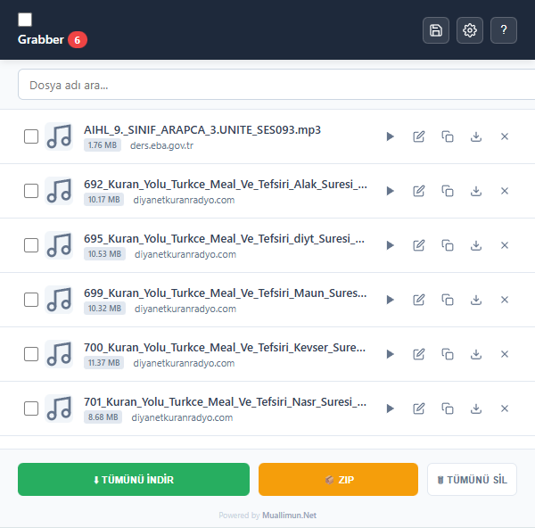

# 🎵 Universal Media Grabber Pro

> **Web sitelerindeki medya akışlarını (MP3, M4A, WAV, M3U8) otomatik yakalayan, akıllı isimlendiren ve toplu indiren profesyonel Chrome eklentisi.**

---

### 🌐 [Resmi Tanıtım ve Kurulum Sayfası İçin Tıklayın](https://www.muallimun.com/MediaGrabberPro/)
*Detaylı görsel anlatım ve kullanım kılavuzu web sitemizdedir.*

---

## 📸 Önizleme

## 🌟 Neden Bu Eklenti?

Bu eklenti, sıradan indiricilerin yapamadığını yapar ve kullanıcı deneyimine odaklanır:

| Özellik | Açıklama |
| :--- | :--- |
| **🕵️‍♂️ Akıllı Yakalama** | Bir medyayı oynattığınız anda ağ trafiğini dinler ve linki havada yakalar. |
| **🏷️ Akıllı İsimlendirme** | `"Dosya.mp3"` gibi anlamsız isimler yerine, tıkladığınız başlığı veya sayfa içeriğini analiz ederek dosyayı doğru isimlendirir (Örn: `001_Fatiha_Suresi.mp3`). |
| **📦 Toplu İndirme** | Listelenen 100'lerce dosyayı tek tıkla sırayla indirir veya ZIP olarak paketler. |
| **📁 Klasörleme** | İndirilen dosyaları `İndirilenler/Radyo_Arsiv` (veya sizin belirlediğiniz) klasöründe düzenli bir şekilde toplar. |
| **🎧 Dahili Oynatıcı** | Dosyayı indirmeden önce eklenti penceresinde dinlemenizi sağlar. |
| **🌍 Çoklu Dil** | Türkçe ve İngilizce dillerini tarayıcınıza göre otomatik tanır. |
| **🛡️ Çift Kayıt Koruması** | Aynı dosyayı listeye tekrar tekrar eklemez, listenizi temiz tutar. |

## 🚀 Kurulum (Geliştirici Modu)

Bu eklenti açık kaynaklıdır ve şu an için manuel yüklenir:

1.  Bu depoyu (repository) **[ZIP Olarak İndirin](https://github.com/muallimun/MediaGrabberPro/archive/refs/heads/main.zip)** ve masaüstünde bir klasöre çıkarın.
2.  Google Chrome tarayıcısını açın ve adres çubuğuna şunu yazın: `chrome://extensions`
3.  Sağ üst köşedeki **"Geliştirici Modu" (Developer Mode)** anahtarını açın.
4.  Sol üstte beliren **"Paketlenmemiş öğe yükle" (Load Unpacked)** butonuna tıklayın.
5.  İndirdiğiniz klasörün içindeki `grabber_extension` klasörünü seçin.
6.  **Tebrikler!** Eklenti yüklendi ve kullanıma hazır.

## 📖 Nasıl Kullanılır?

1.  **Yakala:** Müzik, Podcast veya Radyo içeren bir web sitesine gidin (Örn: Diyanet Radyo, SoundCloud). İstediğiniz parçayı **oynatın** veya başlığına tıklayın.
2.  **Kontrol Et:** Eklenti simgesindeki sayının arttığını göreceksiniz. Eklentiyi açın.
3.  **Yönet:**
    * ▶ **Dinle:** Dosyayı indirmeden önizleyin.
    * ⬇ **İndir:** Tekli olarak indirin.
    * ✏️ **Düzenle:** Dosya adını değiştirmek için kalem ikonuna basın.
    * 📦 **Tümünü İndir:** En alttaki butonu kullanarak listeyi topluca indirin.

> **⚠️ ÖNEMLİ AYAR (Toplu İndirme İçin)**
>
> Eğer çok sayıda dosyayı "Tümünü İndir" butonuyla indirecekseniz, Chrome'un her dosya için *"Nereye kaydedilsin?"* diye sormasını engellemelisiniz.
> 1. Chrome **Ayarlar** > **İndirmeler** menüsüne gidin.
> 2. **"İndirmeden önce her dosyanın nereye kaydedileceğini sor"** seçeneğini **KAPATIN**.

## 🛠️ Kullanılan Teknolojiler

* **JavaScript (ES6+)** - Çekirdek Mantık
* **Chrome Extensions API (Manifest V3)** - Background & Content Scripts
* **JSZip** - Dosya sıkıştırma işlemleri için
* **HTML5 & CSS3** - Modern ve Responsive Arayüz

## 🤝 Katkıda Bulunma

Projeyi geliştirmek isterseniz **Pull Request** göndermekten çekinmeyin! Hataları "Issues" bölümünden bildirebilirsiniz.

## 📄 Lisans

Bu proje [MIT Lisansı](LICENSE) ile lisanslanmıştır. Açık kaynaklıdır ve özgürce dağıtılabilir.

---
Developed with ❤️ by **[Muallimun.Net](https://www.muallimun.com/)**