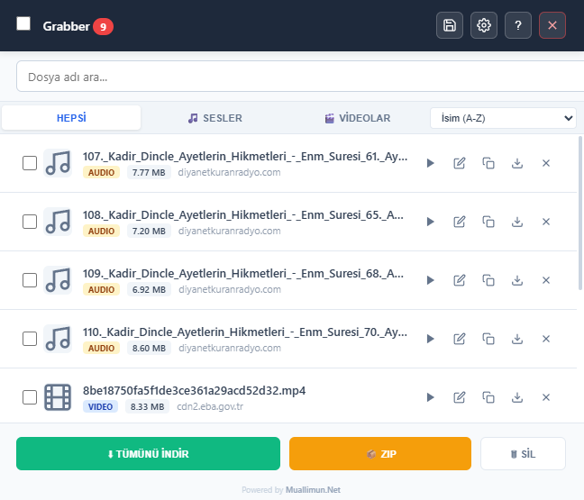

# 🎵 Universal Media Grabber Pro

> **Web sitelerindeki medya akışlarını (MP3, WAV, M4A, AAC, MP4) otomatik yakalayan, v29.2.0 ile gelen gelişmiş dinamik isimlendirme motoruna sahip profesyonel Chrome eklentisi.**

---

### 🌐 [Chrome Web Mağazası'ndan Hemen Yükleyin](https://chromewebstore.google.com/detail/universal-media-grabber-p/klhmnkfafcadbppabkcnokacaflafhdk)
*Resmi sürümü doğrudan mağaza üzerinden kurarak otomatik güncellemelerden yararlanabilirsiniz.*

---

## 📸 Önizleme

## 🌟 Neden Universal Media Grabber Pro?

Bu eklenti, sıradan araçların aksine medya yakalama sürecini tamamen kişiselleştirilebilir ve profesyonel bir deneyime dönüştürür:

| Özellik | Açıklama |
| :--- | :--- |
| **🏷️ Dinamik İsimlendirme** | **Akıllı**, **Sayfa Başlığı**, **URL Son Eki** veya **Özel Başlık** seçenekleriyle dosyalarınızı dilediğiniz gibi adlandırın. |
| **⏱️ Zaman Damgası** | Dosya isimlerine otomatik olarak **Alan Adı**, **Tarih** ve saniyesine kadar **Saat** bilgisi ekleme desteği. |
| **🛡️ Akıllı Spam Kalkanı** | Canlı yayınlardaki parça yağmurunu (TS/M4S) otomatik filtreleyerek listenizi temiz tutar. |
| **📦 Toplu İşlem & ZIP** | Seçilen medyaları toplu olarak indirin veya tek bir **ZIP** arşivi haline getirin. |
| **🔍 Gelişmiş Filtreleme** | Genişletilmiş arama çubuğu ve gelişmiş sıralama (Tarih, İsim, Boyut) seçenekleri. |
| **🌍 Çoklu Dil (i18n)** | Tarayıcı dilinize göre otomatik olarak **Türkçe** veya **İngilizce** arayüz sağlar. |

## 🚀 Kurulum

### 1. Mağaza Üzerinden (Önerilen)
[Chrome Web Mağazası linkine](https://chromewebstore.google.com/detail/universal-media-grabber-p/klhmnkfafcadbppabkcnokacaflafhdk) gidin ve "Chrome'a Ekle" butonuna tıklayın.

### 2. Geliştirici Modu (Manuel)
1. Bu depoyu (repository) **ZIP** olarak indirin ve klasöre çıkarın.
2. Chrome'da `chrome://extensions` adresine gidin.
3. **"Geliştirici Modu"** anahtarını açın.
4. **"Paketlenmemiş öğe yükle"** butonuna tıklayarak klasörü seçin.

## 📖 Nasıl Kullanılır?

1. **Yakalayın:** Bir web sitesinde medya oynatın. Sayaç otomatik olarak artacaktır.
2. **Kişiselleştirin:** Ayarlar (⚙️) menüsünden isimlendirme formatını belirleyin (Örn: Tarih ekle).
3. **Yönetin:**
    * ▶ **Önizleme:** Oynat butonu ile eklenti içinden medyayı kontrol edin.
    * ✏️ **Düzenle:** Kalem ikonuna basarak ismi manuel değiştirin.
    * 🗑 **Temizle:** Gereksiz dosyaları tek tek veya topluca listeden kaldırın.
    * ⬇ **İndir:** Seçilenleri tek tıkla kaydedin.

> **⚠️ ÖNEMLİ AYAR (Toplu İndirme İçin)**
>
> Kesintisiz toplu indirme için: Chrome **Ayarlar** > **İndirmeler** kısmına gidin ve **"İndirmeden önce her dosyanın nereye kaydedileceğini sor"** seçeneğini **KAPATIN**.

## 🛠️ Kullanılan Teknolojiler

* **JavaScript (ES6+)** - Gelişmiş asenkron indirme ve isimlendirme mantığı.
* **Chrome Extensions API (Manifest V3)** - Modern Service Worker mimarisi.
* **JSZip** - İstemci tarafında çalışan dosya sıkıştırma motoru.
* **HTML5 & CSS3** - Responsive tasarım ve Lucide tabanlı ikon seti.

## 🤝 Katkıda Bulunma

Geliştirme önerileri için **Pull Request** gönderebilir veya hataları **Issues** bölümünden bildirebilirsiniz.

## 📄 Lisans

Bu proje **MIT Lisansı** ile lisanslanmıştır. Özgürce kullanılabilir ve dağıtılabilir.

---

Developed with ❤️ by **[Muallimun.Net](https://www.muallimun.com/MediaGrabberPro/)**